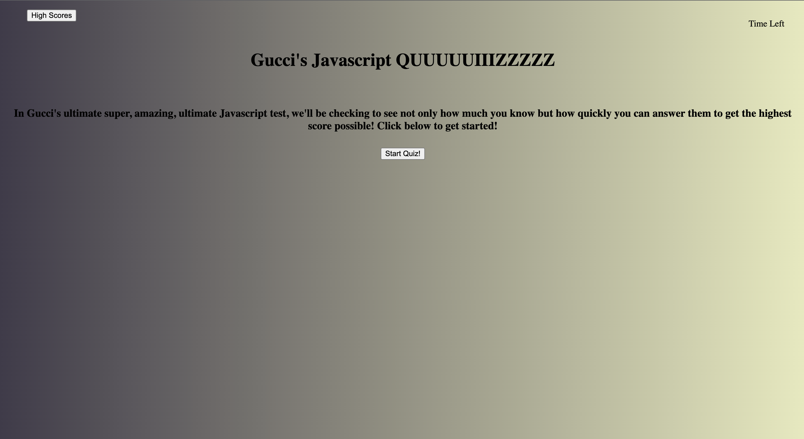

<!-- PROJECT LOGO -->
 

  

  <h3 align="center">The Worlds(my) Best Ever Javascript Quiz</h3>

  

    The best quiz to test your knowledge over javascript.
     

<!-- ABOUT THE PROJECT -->
## About The Project

In this project I combined my extensive(a little bit limited actually) knowledge of CSS, HTML and Javascript to make a quiz that not only counts down in time BUT also ends when there are no more questions.

(<a href="#readme-top">back to top</a>)

### Built With

This page was built with HTML, CSS and Javasript.

### Prerequisites

No prerequisites required.

### Installation

This page requires no installation of any kind simply click on the link, hit start, and test your knowledge and submit your highscore.(PLEEEAASSSEE hit the highscore button after submitting your initials to see your most recent score.)

(<a href="#readme-top">back to top</a>)

<!-- USAGE EXAMPLES -->
## Usage
This page is amazing to test your knowledge over javascript.

(<a href="#readme-top">back to top</a>)

<!-- CONTRIBUTING -->
## Contributing

I am the only direct(instructors and tutor helped) contributer to this Repo.

(<a href="#readme-top">back to top</a>)

<!-- LICENSE -->
## License

MIT 

(<a href="#readme-top">back to top</a>)

<!-- CONTACT -->
## Contact

Fabian Gutierrez - [fabiangutierrez580@gmail.com]
(LinkedIn) - [www.linkedin.com/in/fabian-gutierrez-016523248]

Project Link: [https://guccierrez.github.io/Timed_Quiz/]

<!-- ACKNOWLEDGMENTS -->
## Acknowledgments
Again shout out to My instructors, Mr. Edwards and Mr. Andrew. This week I'd also like to thank my tutor Mr. Andres Jimenez.

<!-- MARKDOWN LINKS & IMAGES -->
